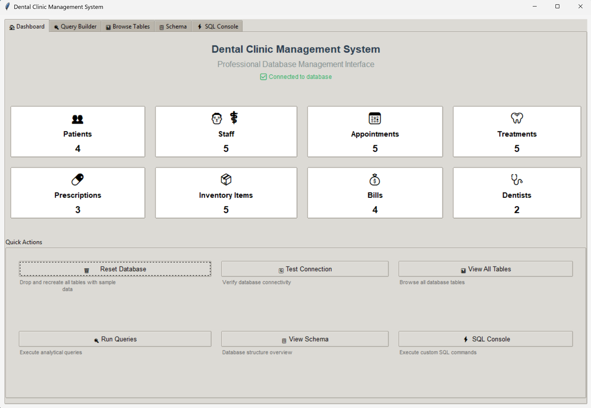

# Dental Clinic Management System

A comprehensive Python GUI application for managing a dental clinic database using Oracle DBMS.

## Features

- 🔐 Secure login with Oracle database credentials
- 📊 Complete table management (create, drop, populate)
- 🔍 Predefined analytical queries
- ⚡ Interactive SQL query interface
- 📋 Database schema viewer
- 🎯 User-friendly modern GUI



## Prerequisites

- Python 3.7+
- Oracle Instant Client
- Oracle database access (oracle.scs.ryerson.ca)

## Installation
2. Install oraclebd 

pip install oracledb 
pip3 install oracledb
1. Install required packages:
```bash
pip install -r requirements.txt
```

## Executable
pyinstaller can be used to package this application for users